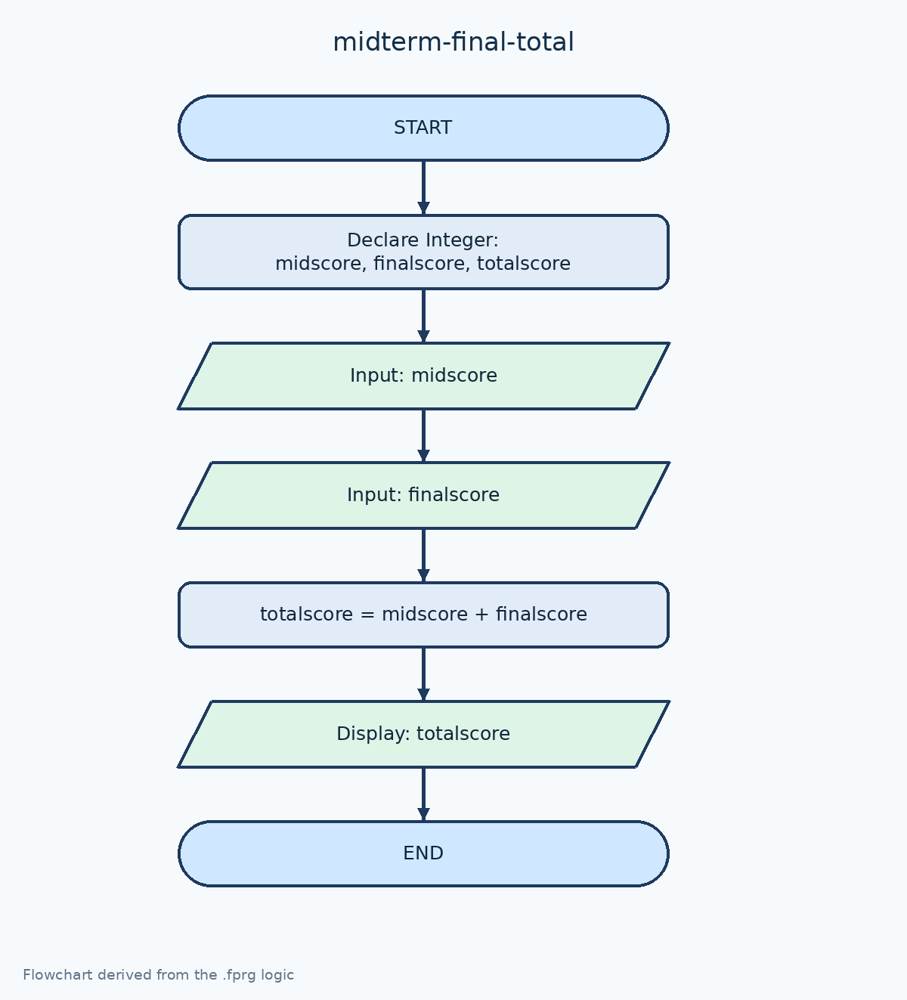

# รวมคะแนนกลางภาคและปลายภาค

[← กลับหน้าหลัก](../README.md) · [ดาวน์โหลดไฟล์ Flowgorithm](./midterm-final-total.fprg)

## โจทย์

รับคะแนนกลางภาคและปลายภาค แล้วหาคะแนนรวม

**แนวคิดที่ฝึก:** ลำดับคำสั่ง (Sequence), การรับค่า, การคำนวณ และการแสดงผล

## Flowchart



> ภาพนี้ถอดจากตรรกะในไฟล์ `.fprg` เพื่อให้ดูบน GitHub ได้ทันที ส่วนผังงานต้นฉบับให้ดาวน์โหลดไฟล์แล้วเปิดด้วย Flowgorithm

## Pseudocode

```text
เริ่มต้น
    ประกาศ Integer midscore, finalscore, totalscore
    แสดงผล "Enter midterm score: "
    รับค่า midscore
    แสดงผล "Enter final score: "
    รับค่า finalscore
    totalscore ← midscore + finalscore
    แสดงผล "Total score = " & totalscore
จบการทำงาน
```

## ทดลองให้ครบ

- ทดสอบค่าปกติที่ควรผ่าน
- หากมีการตรวจช่วง ให้ทดสอบค่าต่ำกว่าขอบเขตและสูงกว่าขอบเขต
- เปรียบเทียบผลลัพธ์กับการคำนวณด้วยตนเอง
