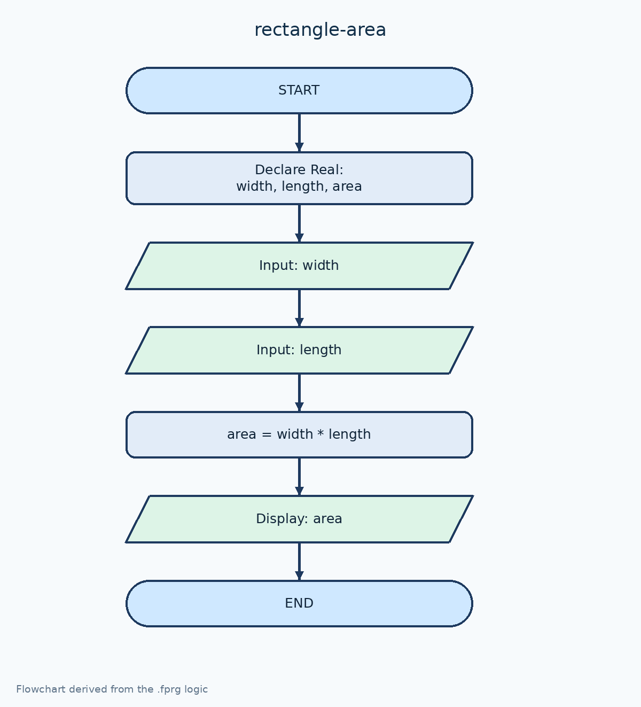

# คำนวณพื้นที่สี่เหลี่ยมผืนผ้า

[← กลับหน้าหลัก](../README.md) · [ดาวน์โหลดไฟล์ Flowgorithm](./rectangle-area.fprg)

## โจทย์

รับค่าความกว้างและความยาว แล้วคำนวณพื้นที่ด้วยสูตร `width × length`

**แนวคิดที่ฝึก:** ลำดับคำสั่ง (Sequence), การรับค่า, การคำนวณ และการแสดงผล

## Flowchart



> ภาพนี้ถอดจากตรรกะในไฟล์ `.fprg` เพื่อให้ดูบน GitHub ได้ทันที ส่วนผังงานต้นฉบับให้ดาวน์โหลดไฟล์แล้วเปิดด้วย Flowgorithm

## Pseudocode

```text
เริ่มต้น
    ประกาศ Real width, length, area
    แสดงผล "Enter width: "
    รับค่า width
    แสดงผล "Enter length: "
    รับค่า length
    area ← width * length
    แสดงผล "Area of rectangle = " & area
จบการทำงาน
```

## ทดลองให้ครบ

- ทดสอบค่าปกติที่ควรผ่าน
- หากมีการตรวจช่วง ให้ทดสอบค่าต่ำกว่าขอบเขตและสูงกว่าขอบเขต
- เปรียบเทียบผลลัพธ์กับการคำนวณด้วยตนเอง
