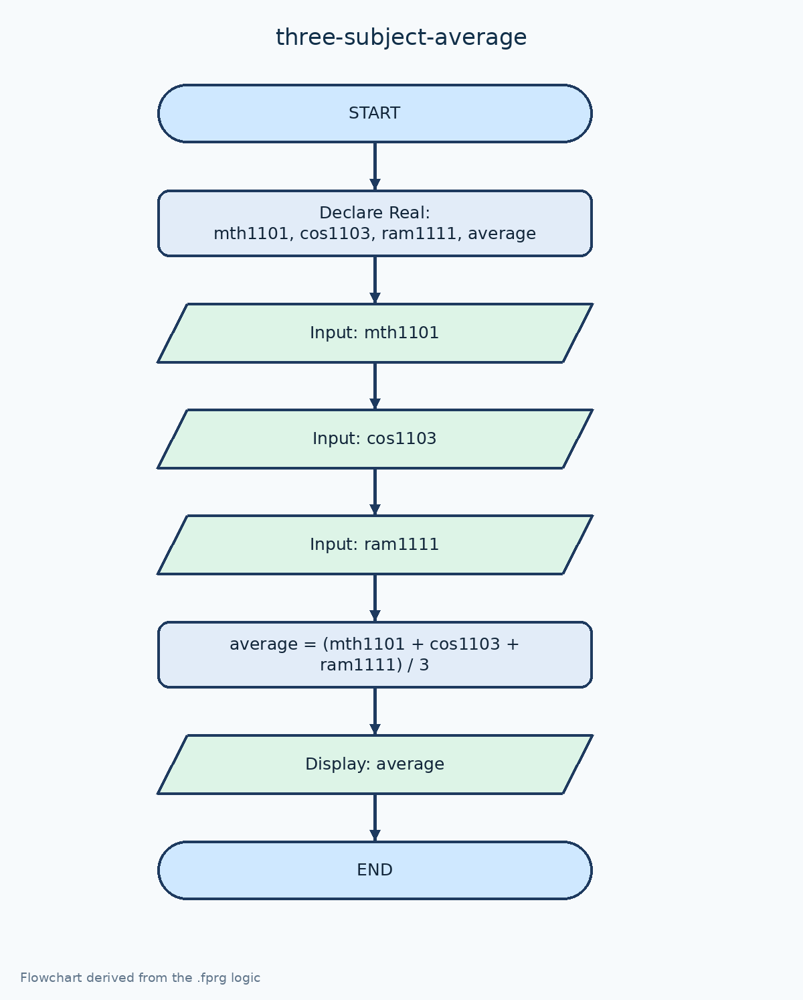

# หาคะแนนเฉลี่ย 3 วิชา

[← กลับหน้าหลัก](../README.md) · [ดาวน์โหลดไฟล์ Flowgorithm](./three-subject-average.fprg)

## โจทย์

รับคะแนน MTH1101, COS1103 และ RAM1111 แล้วคำนวณค่าเฉลี่ย

**แนวคิดที่ฝึก:** ลำดับคำสั่ง (Sequence), การรับค่า, การคำนวณ และการแสดงผล

## Flowchart



> ภาพนี้ถอดจากตรรกะในไฟล์ `.fprg` เพื่อให้ดูบน GitHub ได้ทันที ส่วนผังงานต้นฉบับให้ดาวน์โหลดไฟล์แล้วเปิดด้วย Flowgorithm

## Pseudocode

```text
เริ่มต้น
    ประกาศ Real mth1101, cos1103, ram1111, average
    แสดงผล "Enter MTH1101 score: "
    รับค่า mth1101
    แสดงผล "Enter COS1103 score: "
    รับค่า cos1103
    แสดงผล "Enter RAM1111 score: "
    รับค่า ram1111
    average ← (mth1101 + cos1103 + ram1111) / 3
    แสดงผล "Average score = " & average
จบการทำงาน
```

## ทดลองให้ครบ

- ทดสอบค่าปกติที่ควรผ่าน
- หากมีการตรวจช่วง ให้ทดสอบค่าต่ำกว่าขอบเขตและสูงกว่าขอบเขต
- เปรียบเทียบผลลัพธ์กับการคำนวณด้วยตนเอง
