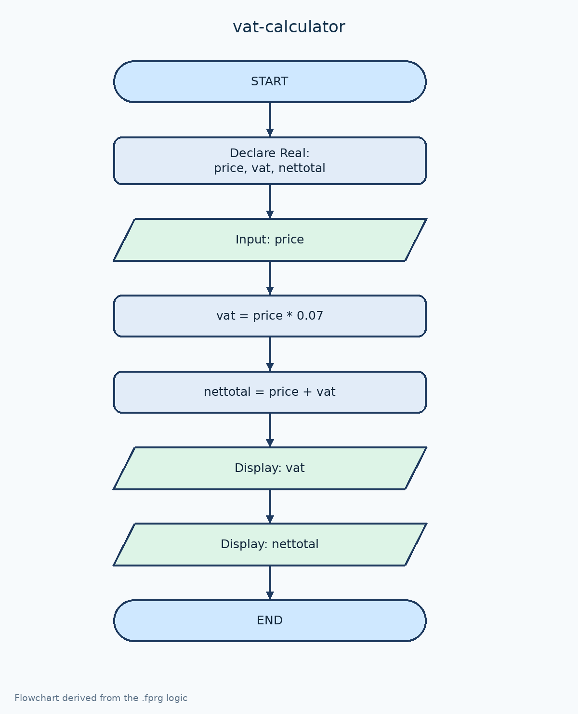

# คำนวณ VAT 7% และยอดสุทธิ

[← กลับหน้าหลัก](../README.md) · [ดาวน์โหลดไฟล์ Flowgorithm](./vat-calculator.fprg)

## โจทย์

รับราคาก่อน VAT คำนวณภาษี 7% และยอดสุทธิที่ต้องชำระ

**แนวคิดที่ฝึก:** ลำดับคำสั่ง (Sequence), การรับค่า, การคำนวณ และการแสดงผล

## Flowchart



> ภาพนี้ถอดจากตรรกะในไฟล์ `.fprg` เพื่อให้ดูบน GitHub ได้ทันที ส่วนผังงานต้นฉบับให้ดาวน์โหลดไฟล์แล้วเปิดด้วย Flowgorithm

## Pseudocode

```text
เริ่มต้น
    ประกาศ Real price, vat, nettotal
    แสดงผล "กรอกราคาก่อน VAT: "
    รับค่า price
    vat ← price * 0.07
    nettotal ← price + vat
    แสดงผล "VAT 7% = " & vat & " บาท"
    แสดงผล "ยอดสุทธิ = " & nettotal & " บาท"
จบการทำงาน
```

## ทดลองให้ครบ

- ทดสอบค่าปกติที่ควรผ่าน
- หากมีการตรวจช่วง ให้ทดสอบค่าต่ำกว่าขอบเขตและสูงกว่าขอบเขต
- เปรียบเทียบผลลัพธ์กับการคำนวณด้วยตนเอง
