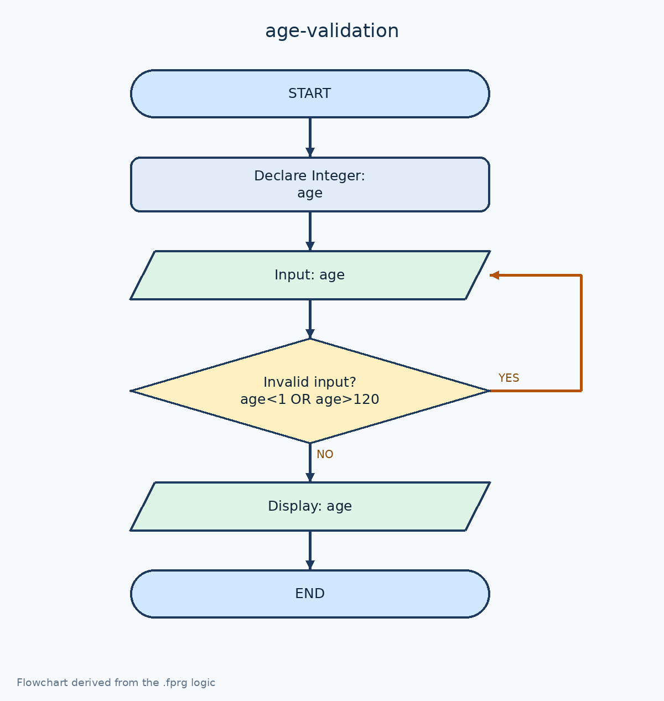

# ตรวจสอบอายุ 1–120 ปี

[← กลับหน้าหลัก](../README.md) · [ดาวน์โหลดไฟล์ Flowgorithm](./age-validation.fprg)

## โจทย์

รับอายุซ้ำจนกว่าจะอยู่ในช่วง 1–120 ปี แล้วจึงแสดงผล

**แนวคิดที่ฝึก:** การตรวจสอบช่วงข้อมูลด้วย `Do...While` ก่อนนำค่าไปใช้

## Flowchart



> ภาพนี้ถอดจากตรรกะในไฟล์ `.fprg` เพื่อให้ดูบน GitHub ได้ทันที ส่วนผังงานต้นฉบับให้ดาวน์โหลดไฟล์แล้วเปิดด้วย Flowgorithm

## Pseudocode

```text
เริ่มต้น
    ประกาศ Integer age
    ทำซ้ำ
        แสดงผล "กรอกอายุ (1-120 ปี)"
        รับค่า age
    ขณะที่ age < 1 หรือ age > 120
    แสดงผล "อายุ = " & age & " ปี"
จบการทำงาน
```

## ทดลองให้ครบ

- ทดสอบค่าปกติที่ควรผ่าน
- หากมีการตรวจช่วง ให้ทดสอบค่าต่ำกว่าขอบเขตและสูงกว่าขอบเขต
- เปรียบเทียบผลลัพธ์กับการคำนวณด้วยตนเอง
