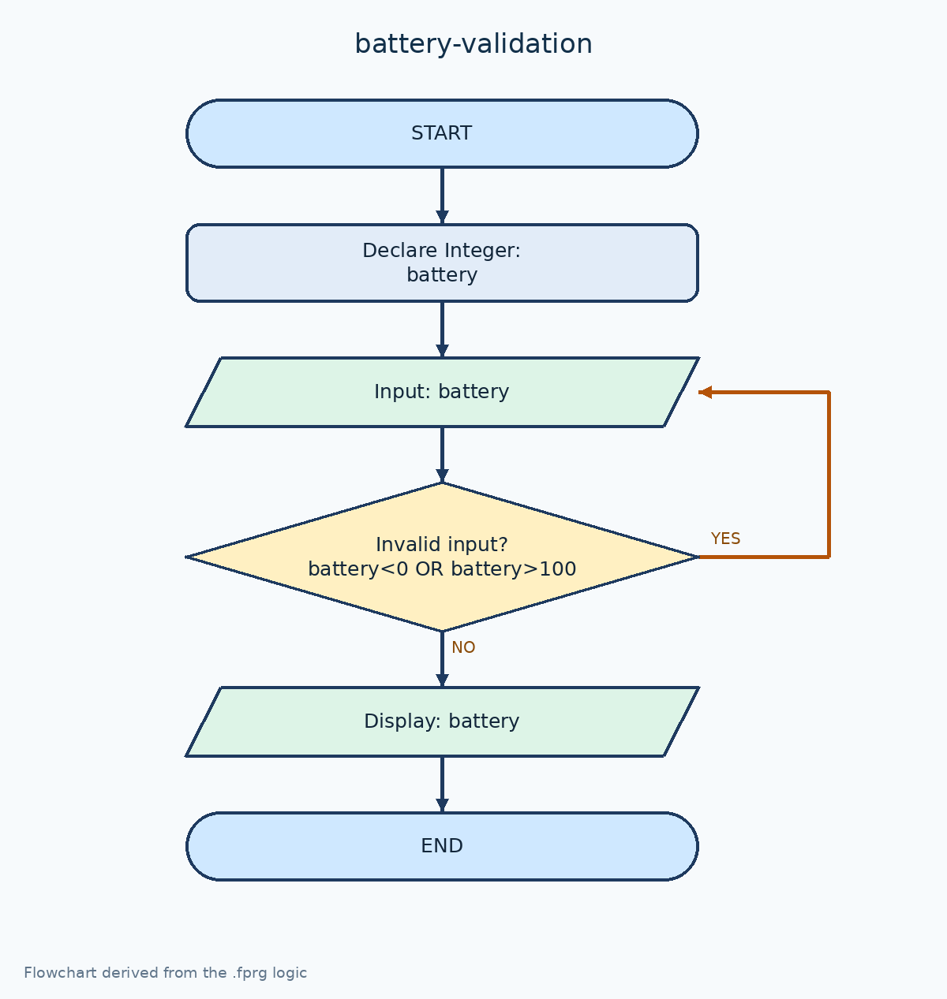

# ตรวจสอบแบตเตอรี่ 0–100%

[← กลับหน้าหลัก](../README.md) · [ดาวน์โหลดไฟล์ Flowgorithm](./battery-validation.fprg)

## โจทย์

รับเปอร์เซ็นต์แบตเตอรี่ซ้ำจนกว่าจะอยู่ในช่วง 0–100%

**แนวคิดที่ฝึก:** การตรวจสอบช่วงข้อมูลด้วย `Do...While` ก่อนนำค่าไปใช้

## Flowchart



> ภาพนี้ถอดจากตรรกะในไฟล์ `.fprg` เพื่อให้ดูบน GitHub ได้ทันที ส่วนผังงานต้นฉบับให้ดาวน์โหลดไฟล์แล้วเปิดด้วย Flowgorithm

## Pseudocode

```text
เริ่มต้น
    ประกาศ Integer battery
    ทำซ้ำ
        แสดงผล "กรอกเปอร์เซ็นต์แบตเตอรี่ (0-100)"
        รับค่า battery
    ขณะที่ battery < 0 หรือ battery > 100
    แสดงผล "แบตเตอรี่เหลือ = " & battery & "%"
จบการทำงาน
```

## ทดลองให้ครบ

- ทดสอบค่าปกติที่ควรผ่าน
- หากมีการตรวจช่วง ให้ทดสอบค่าต่ำกว่าขอบเขตและสูงกว่าขอบเขต
- เปรียบเทียบผลลัพธ์กับการคำนวณด้วยตนเอง
