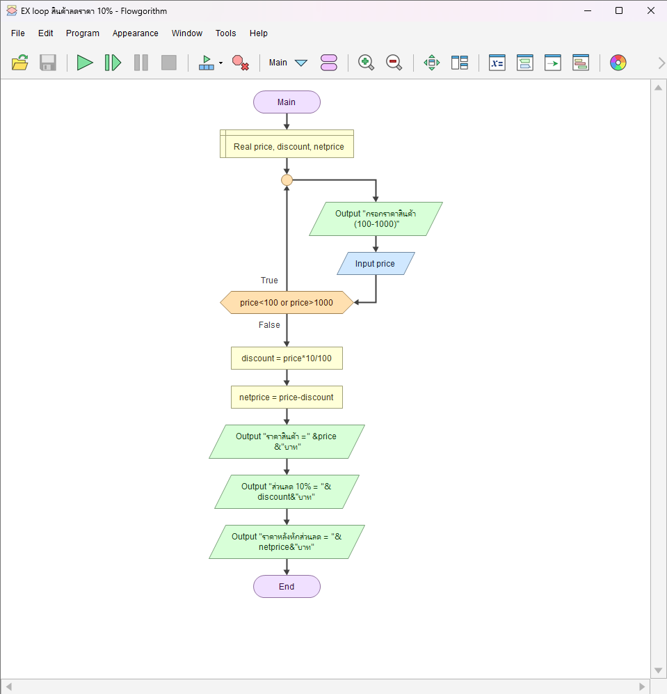

# ตรวจราคาและคำนวณส่วนลด 10%

[← กลับหน้าหลัก](../README.md) · [ดาวน์โหลดไฟล์ Flowgorithm](./discount-calculator.fprg)

## โจทย์

ตรวจราคาสินค้าให้อยู่ในช่วง 1–5,000 บาท แล้วคำนวณส่วนลด 10% และราคาสุทธิ

**แนวคิดที่ฝึก:** การตรวจสอบช่วงข้อมูลด้วย `Do...While` ก่อนนำค่าไปใช้

## ผังงานจาก Flowgorithm



> ภาพหน้าจอนี้มาจากโปรแกรม Flowgorithm และจับคู่กับไฟล์ต้นฉบับของโจทย์นี้โดยตรง

## Pseudocode

```text
เริ่มต้น
    ประกาศ Real price, discount, netprice
    ทำซ้ำ
        แสดงผล "กรอกราคาสินค้า (1-5000 บาท)"
        รับค่า price
    ขณะที่ price < 1 หรือ price > 5000
    discount ← price * 0.10
    netprice ← price - discount
    แสดงผล "ส่วนลด 10% = " & discount & " บาท"
    แสดงผล "ราคาหลังหักส่วนลด = " & netprice & " บาท"
จบการทำงาน
```

## ทดลองให้ครบ

- ทดสอบค่าปกติที่ควรผ่าน
- หากมีการตรวจช่วง ให้ทดสอบค่าต่ำกว่าขอบเขตและสูงกว่าขอบเขต
- เปรียบเทียบผลลัพธ์กับการคำนวณด้วยตนเอง
