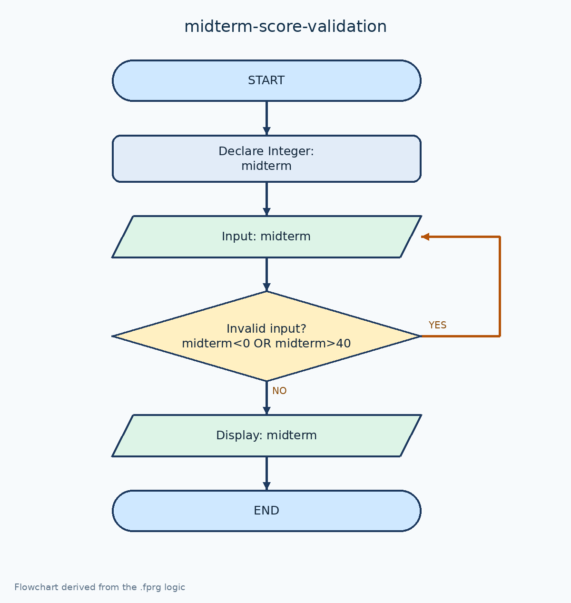

# ตรวจสอบคะแนนกลางภาค 0–40

[← กลับหน้าหลัก](../README.md) · [ดาวน์โหลดไฟล์ Flowgorithm](./midterm-score-validation.fprg)

## โจทย์

รับคะแนนกลางภาคซ้ำจนกว่าจะอยู่ในช่วง 0–40 คะแนน

**แนวคิดที่ฝึก:** การตรวจสอบช่วงข้อมูลด้วย `Do...While` ก่อนนำค่าไปใช้

## Flowchart



> ภาพนี้ถอดจากตรรกะในไฟล์ `.fprg` เพื่อให้ดูบน GitHub ได้ทันที ส่วนผังงานต้นฉบับให้ดาวน์โหลดไฟล์แล้วเปิดด้วย Flowgorithm

## Pseudocode

```text
เริ่มต้น
    ประกาศ Integer midterm
    ทำซ้ำ
        แสดงผล "กรอกคะแนนกลางภาค (0-40)"
        รับค่า midterm
    ขณะที่ midterm < 0 หรือ midterm > 40
    แสดงผล "คะแนนกลางภาค = " & midterm & " คะแนน"
จบการทำงาน
```

## ทดลองให้ครบ

- ทดสอบค่าปกติที่ควรผ่าน
- หากมีการตรวจช่วง ให้ทดสอบค่าต่ำกว่าขอบเขตและสูงกว่าขอบเขต
- เปรียบเทียบผลลัพธ์กับการคำนวณด้วยตนเอง
