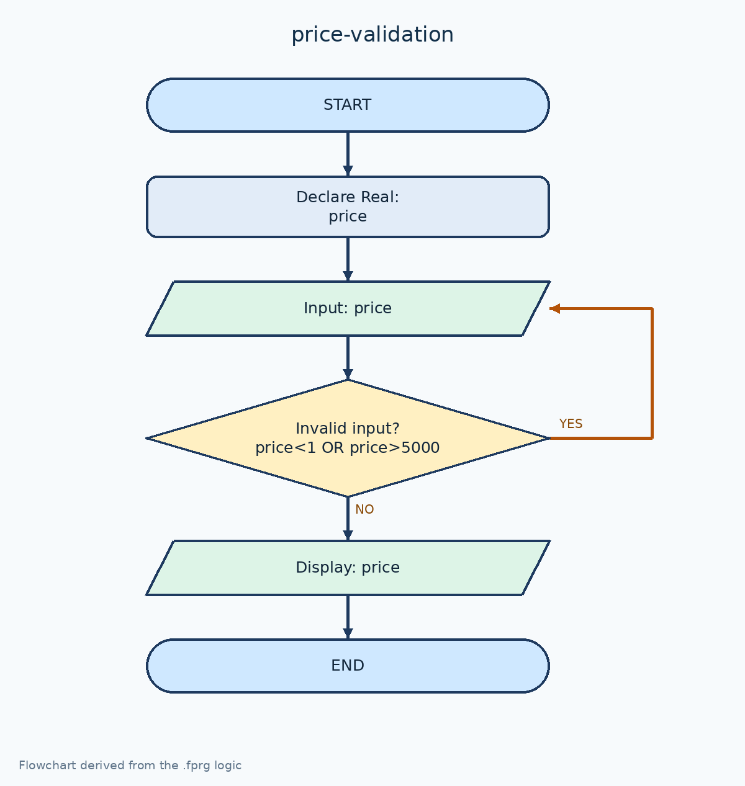

# ตรวจสอบราคาสินค้า 1–5,000 บาท

[← กลับหน้าหลัก](../README.md) · [ดาวน์โหลดไฟล์ Flowgorithm](./price-validation.fprg)

## โจทย์

รับราคาซ้ำจนกว่าจะอยู่ในช่วง 1–5,000 บาท แล้วจึงแสดงผล

**แนวคิดที่ฝึก:** การตรวจสอบช่วงข้อมูลด้วย `Do...While` ก่อนนำค่าไปใช้

## Flowchart



> ภาพนี้ถอดจากตรรกะในไฟล์ `.fprg` เพื่อให้ดูบน GitHub ได้ทันที ส่วนผังงานต้นฉบับให้ดาวน์โหลดไฟล์แล้วเปิดด้วย Flowgorithm

## Pseudocode

```text
เริ่มต้น
    ประกาศ Real price
    ทำซ้ำ
        แสดงผล "กรอกราคาสินค้า (1-5000 บาท)"
        รับค่า price
    ขณะที่ price < 1 หรือ price > 5000
    แสดงผล "ราคาสินค้า = " & price & " บาท"
จบการทำงาน
```

## ทดลองให้ครบ

- ทดสอบค่าปกติที่ควรผ่าน
- หากมีการตรวจช่วง ให้ทดสอบค่าต่ำกว่าขอบเขตและสูงกว่าขอบเขต
- เปรียบเทียบผลลัพธ์กับการคำนวณด้วยตนเอง
