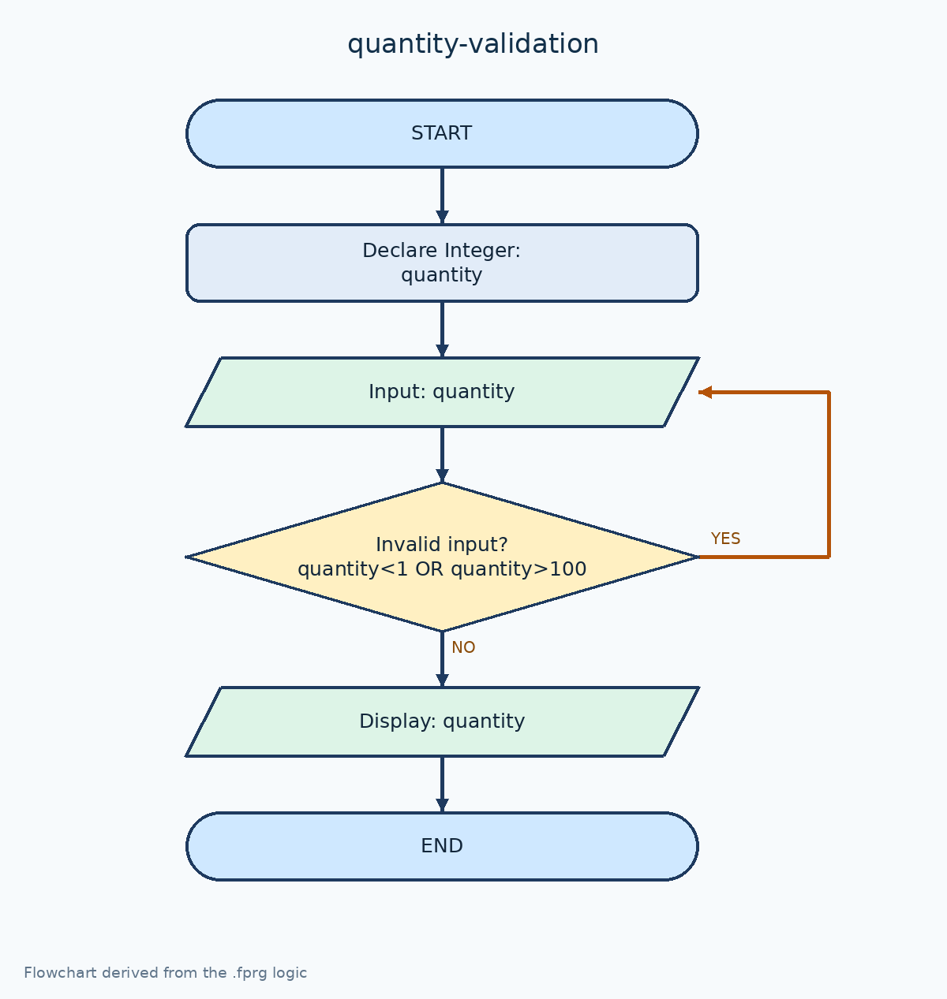

# ตรวจสอบจำนวนสินค้า 1–100 ชิ้น

[← กลับหน้าหลัก](../README.md) · [ดาวน์โหลดไฟล์ Flowgorithm](./quantity-validation.fprg)

## โจทย์

รับจำนวนสินค้าซ้ำจนกว่าจะอยู่ในช่วง 1–100 ชิ้น

**แนวคิดที่ฝึก:** การตรวจสอบช่วงข้อมูลด้วย `Do...While` ก่อนนำค่าไปใช้

## Flowchart



> ภาพนี้ถอดจากตรรกะในไฟล์ `.fprg` เพื่อให้ดูบน GitHub ได้ทันที ส่วนผังงานต้นฉบับให้ดาวน์โหลดไฟล์แล้วเปิดด้วย Flowgorithm

## Pseudocode

```text
เริ่มต้น
    ประกาศ Integer quantity
    ทำซ้ำ
        แสดงผล "กรอกจำนวนสินค้า (1-100 ชิ้น)"
        รับค่า quantity
    ขณะที่ quantity < 1 หรือ quantity > 100
    แสดงผล "จำนวนสินค้า = " & quantity & " ชิ้น"
จบการทำงาน
```

## ทดลองให้ครบ

- ทดสอบค่าปกติที่ควรผ่าน
- หากมีการตรวจช่วง ให้ทดสอบค่าต่ำกว่าขอบเขตและสูงกว่าขอบเขต
- เปรียบเทียบผลลัพธ์กับการคำนวณด้วยตนเอง
