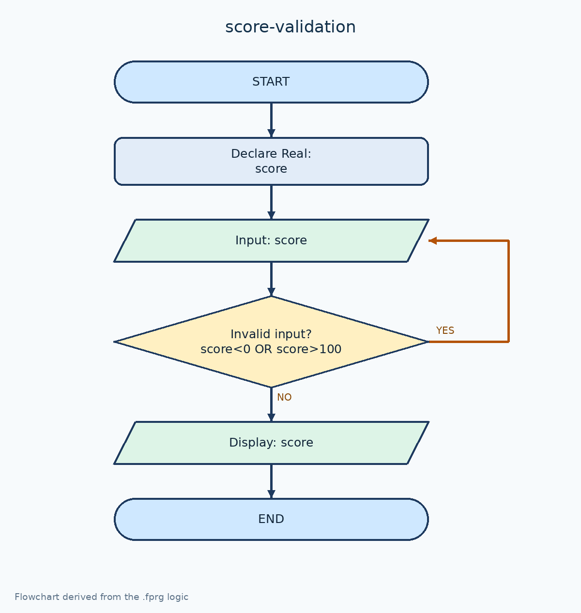

# ตรวจสอบคะแนน 0–100

[← กลับหน้าหลัก](../README.md) · [ดาวน์โหลดไฟล์ Flowgorithm](./score-validation.fprg)

## โจทย์

รับคะแนนซ้ำจนกว่าจะอยู่ในช่วง 0–100 คะแนน

**แนวคิดที่ฝึก:** การตรวจสอบช่วงข้อมูลด้วย `Do...While` ก่อนนำค่าไปใช้

## Flowchart



> ภาพนี้ถอดจากตรรกะในไฟล์ `.fprg` เพื่อให้ดูบน GitHub ได้ทันที ส่วนผังงานต้นฉบับให้ดาวน์โหลดไฟล์แล้วเปิดด้วย Flowgorithm

## Pseudocode

```text
เริ่มต้น
    ประกาศ Real score
    ทำซ้ำ
        แสดงผล "กรอกคะแนน (0-100)"
        รับค่า score
    ขณะที่ score < 0 หรือ score > 100
    แสดงผล "คะแนน = " & score & " คะแนน"
จบการทำงาน
```

## ทดลองให้ครบ

- ทดสอบค่าปกติที่ควรผ่าน
- หากมีการตรวจช่วง ให้ทดสอบค่าต่ำกว่าขอบเขตและสูงกว่าขอบเขต
- เปรียบเทียบผลลัพธ์กับการคำนวณด้วยตนเอง
