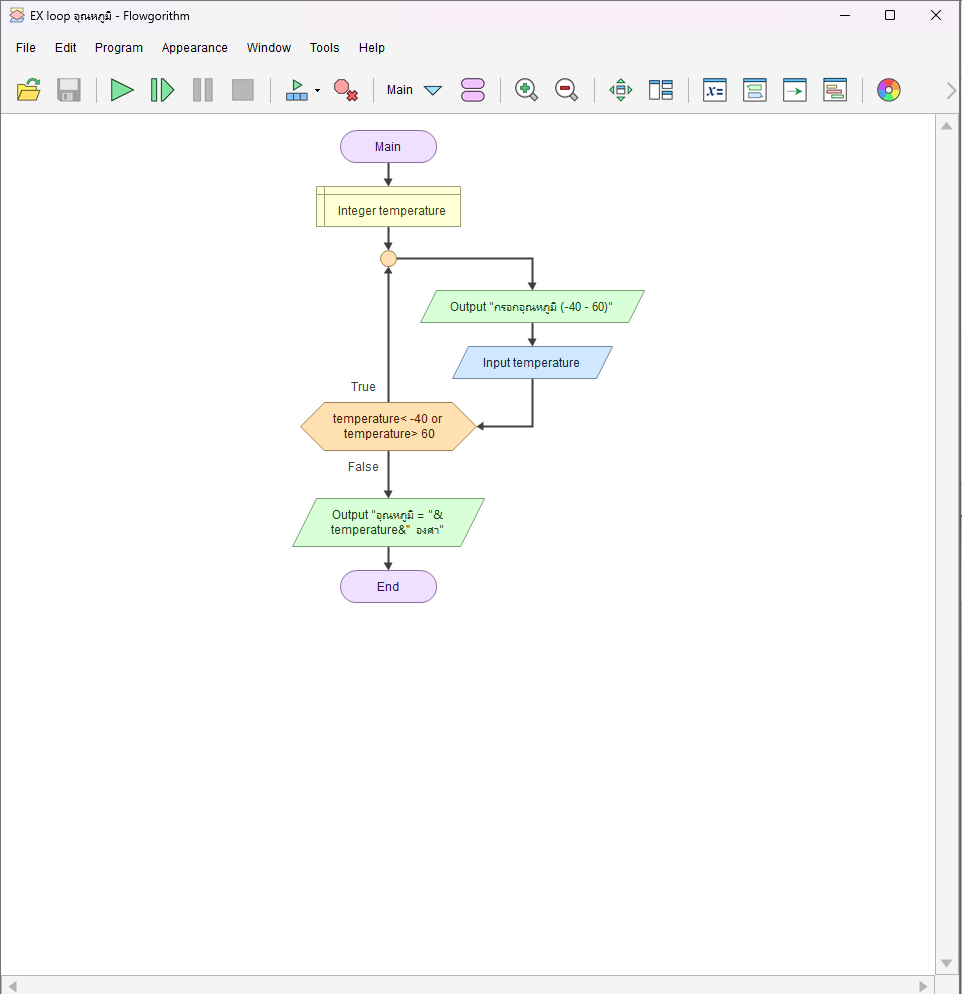

# ตรวจสอบอุณหภูมิ -40 ถึง 60 °C

[← กลับหน้าหลัก](../README.md) · [ดาวน์โหลดไฟล์ Flowgorithm](./temperature-validation.fprg)

## โจทย์

รับอุณหภูมิซ้ำจนกว่าจะอยู่ในช่วง -40 ถึง 60 องศาเซลเซียส

**แนวคิดที่ฝึก:** การตรวจสอบช่วงข้อมูลด้วย `Do...While` ก่อนนำค่าไปใช้

## ผังงานจาก Flowgorithm



> ภาพหน้าจอนี้มาจากโปรแกรม Flowgorithm และจับคู่กับไฟล์ต้นฉบับของโจทย์นี้โดยตรง

## Pseudocode

```text
เริ่มต้น
    ประกาศ Real temperature
    ทำซ้ำ
        แสดงผล "กรอกอุณหภูมิ (-40 ถึง 60 องศาเซลเซียส)"
        รับค่า temperature
    ขณะที่ temperature < -40 หรือ temperature > 60
    แสดงผล "อุณหภูมิ = " & temperature & " องศาเซลเซียส"
จบการทำงาน
```

## ทดลองให้ครบ

- ทดสอบค่าปกติที่ควรผ่าน
- หากมีการตรวจช่วง ให้ทดสอบค่าต่ำกว่าขอบเขตและสูงกว่าขอบเขต
- เปรียบเทียบผลลัพธ์กับการคำนวณด้วยตนเอง
