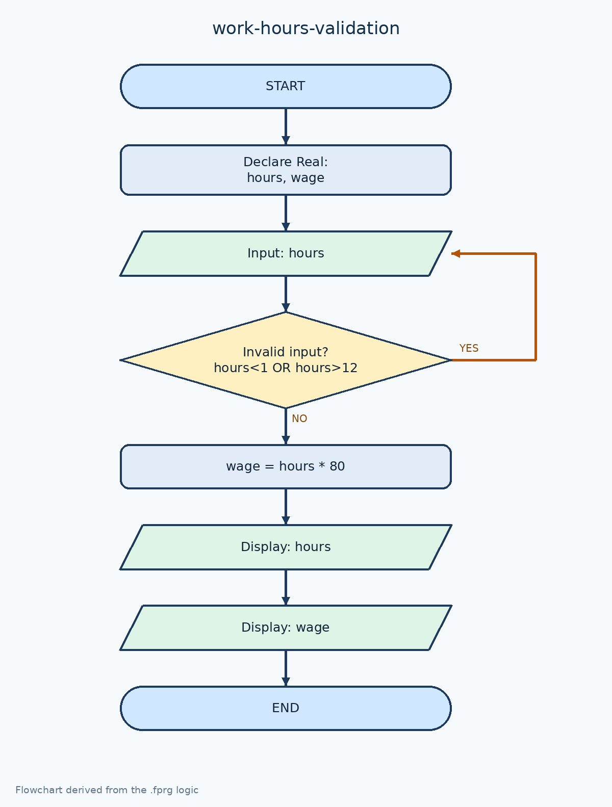

# ตรวจชั่วโมงทำงานและคำนวณค่าจ้าง

[← กลับหน้าหลัก](../README.md) · [ดาวน์โหลดไฟล์ Flowgorithm](./work-hours-validation.fprg)

## โจทย์

ตรวจชั่วโมงทำงานให้อยู่ในช่วง 1–12 ชั่วโมง แล้วคำนวณค่าจ้างชั่วโมงละ 80 บาท

**แนวคิดที่ฝึก:** การตรวจสอบช่วงข้อมูลด้วย `Do...While` ก่อนนำค่าไปใช้

## Flowchart



> ภาพนี้ถอดจากตรรกะในไฟล์ `.fprg` เพื่อให้ดูบน GitHub ได้ทันที ส่วนผังงานต้นฉบับให้ดาวน์โหลดไฟล์แล้วเปิดด้วย Flowgorithm

## Pseudocode

```text
เริ่มต้น
    ประกาศ Real hours, wage
    ทำซ้ำ
        แสดงผล "กรอกชั่วโมงการทำงาน (1-12 ชั่วโมง)"
        รับค่า hours
    ขณะที่ hours < 1 หรือ hours > 12
    wage ← hours * 80
    แสดงผล "ชั่วโมงการทำงาน = " & hours & " ชั่วโมง"
    แสดงผล "ค่าจ้าง = " & wage & " บาท"
จบการทำงาน
```

## ทดลองให้ครบ

- ทดสอบค่าปกติที่ควรผ่าน
- หากมีการตรวจช่วง ให้ทดสอบค่าต่ำกว่าขอบเขตและสูงกว่าขอบเขต
- เปรียบเทียบผลลัพธ์กับการคำนวณด้วยตนเอง
