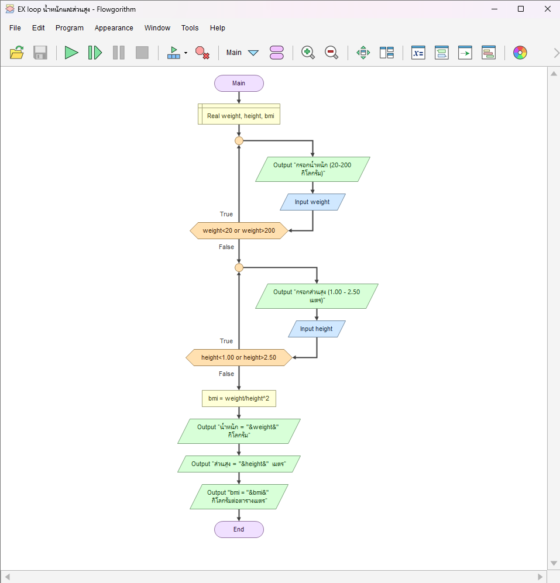

# ตรวจน้ำหนัก–ส่วนสูงและคำนวณ BMI

[← กลับหน้าหลัก](../README.md) · [ดาวน์โหลดไฟล์ Flowgorithm](./bmi-calculator.fprg)

## โจทย์

ตรวจน้ำหนักและส่วนสูงให้อยู่ในช่วงที่กำหนด ก่อนคำนวณค่า BMI

**แนวคิดที่ฝึก:** การตรวจข้อมูลหลายค่าและเงื่อนไขที่สัมพันธ์กัน

## ผังงานจาก Flowgorithm



> ภาพหน้าจอนี้มาจากโปรแกรม Flowgorithm และจับคู่กับไฟล์ต้นฉบับของโจทย์นี้โดยตรง

## Pseudocode

```text
เริ่มต้น
    ประกาศ Real weight, height, bmi
    ทำซ้ำ
        แสดงผล "กรอกน้ำหนัก (20-200 กิโลกรัม)"
        รับค่า weight
    ขณะที่ weight < 20 หรือ weight > 200
    ทำซ้ำ
        แสดงผล "กรอกส่วนสูง (1.00 - 2.50 เมตร)"
        รับค่า height
    ขณะที่ height < 1.00 หรือ height > 2.50
    bmi ← weight / (height ^ 2)
    แสดงผล "น้ำหนัก = " & weight & " กิโลกรัม"
    แสดงผล "ส่วนสูง = " & height & " เมตร"
    แสดงผล "BMI = " & bmi & " กิโลกรัมต่อตารางเมตร"
จบการทำงาน
```

## ทดลองให้ครบ

- ทดสอบค่าปกติที่ควรผ่าน
- หากมีการตรวจช่วง ให้ทดสอบค่าต่ำกว่าขอบเขตและสูงกว่าขอบเขต
- เปรียบเทียบผลลัพธ์กับการคำนวณด้วยตนเอง
