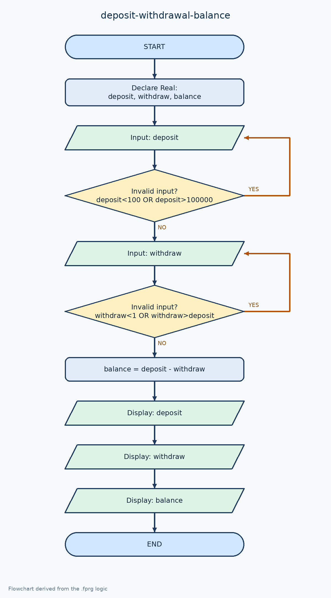

# ตรวจยอดถอนและคำนวณยอดคงเหลือ

[← กลับหน้าหลัก](../README.md) · [ดาวน์โหลดไฟล์ Flowgorithm](./deposit-withdrawal-balance.fprg)

## โจทย์

ตรวจยอดฝากก่อน จากนั้นตรวจว่ายอดถอนไม่เกินยอดฝาก แล้วคำนวณยอดคงเหลือ

**แนวคิดที่ฝึก:** การตรวจข้อมูลหลายค่าและเงื่อนไขที่สัมพันธ์กัน

## Flowchart



> ภาพนี้ถอดจากตรรกะในไฟล์ `.fprg` เพื่อให้ดูบน GitHub ได้ทันที ส่วนผังงานต้นฉบับให้ดาวน์โหลดไฟล์แล้วเปิดด้วย Flowgorithm

## Pseudocode

```text
เริ่มต้น
    ประกาศ Real deposit, withdraw, balance
    ทำซ้ำ
        แสดงผล "กรอกยอดเงินฝาก (100-100000 บาท)"
        รับค่า deposit
    ขณะที่ deposit < 100 หรือ deposit > 100000
    ทำซ้ำ
        แสดงผล "กรอกยอดถอน (อย่างน้อย 1 บาทและไม่เกินยอดฝาก)"
        รับค่า withdraw
    ขณะที่ withdraw < 1 หรือ withdraw > deposit
    balance ← deposit - withdraw
    แสดงผล "ยอดเงินฝาก = " & deposit & " บาท"
    แสดงผล "ยอดถอนเงิน = " & withdraw & " บาท"
    แสดงผล "ยอดเงินคงเหลือ = " & balance & " บาท"
จบการทำงาน
```

## ทดลองให้ครบ

- ทดสอบค่าปกติที่ควรผ่าน
- หากมีการตรวจช่วง ให้ทดสอบค่าต่ำกว่าขอบเขตและสูงกว่าขอบเขต
- เปรียบเทียบผลลัพธ์กับการคำนวณด้วยตนเอง
