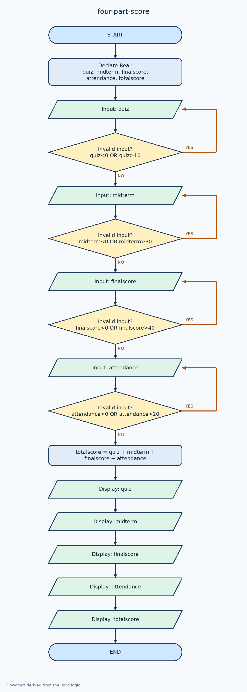

# ตรวจและรวมคะแนน 4 ส่วน

[← กลับหน้าหลัก](../README.md) · [ดาวน์โหลดไฟล์ Flowgorithm](./four-part-score.fprg)

## โจทย์

ตรวจคะแนนควิซ กลางภาค ปลายภาค และเข้าเรียน แล้วคำนวณคะแนนรวม 100 คะแนน

**แนวคิดที่ฝึก:** การตรวจข้อมูลหลายค่าและเงื่อนไขที่สัมพันธ์กัน

## Flowchart



> ภาพนี้ถอดจากตรรกะในไฟล์ `.fprg` เพื่อให้ดูบน GitHub ได้ทันที ส่วนผังงานต้นฉบับให้ดาวน์โหลดไฟล์แล้วเปิดด้วย Flowgorithm

## Pseudocode

```text
เริ่มต้น
    ประกาศ Real quiz, midterm, finalscore, attendance, totalscore
    ทำซ้ำ
        แสดงผล "กรอกคะแนนควิส (0-10)"
        รับค่า quiz
    ขณะที่ quiz < 0 หรือ quiz > 10
    ทำซ้ำ
        แสดงผล "กรอกคะแนนกลางภาค (0-30)"
        รับค่า midterm
    ขณะที่ midterm < 0 หรือ midterm > 30
    ทำซ้ำ
        แสดงผล "กรอกคะแนนปลายภาค (0-40)"
        รับค่า finalscore
    ขณะที่ finalscore < 0 หรือ finalscore > 40
    ทำซ้ำ
        แสดงผล "กรอกคะแนนเข้าเรียน (0-20)"
        รับค่า attendance
    ขณะที่ attendance < 0 หรือ attendance > 20
    totalscore ← quiz + midterm + finalscore + attendance
    แสดงผล "คะแนนควิส = " & quiz & " คะแนน"
    แสดงผล "คะแนนกลางภาค = " & midterm & " คะแนน"
    แสดงผล "คะแนนปลายภาค = " & finalscore & " คะแนน"
    แสดงผล "คะแนนเข้าเรียน = " & attendance & " คะแนน"
    แสดงผล "คะแนนรวม = " & totalscore & " คะแนน"
จบการทำงาน
```

## ทดลองให้ครบ

- ทดสอบค่าปกติที่ควรผ่าน
- หากมีการตรวจช่วง ให้ทดสอบค่าต่ำกว่าขอบเขตและสูงกว่าขอบเขต
- เปรียบเทียบผลลัพธ์กับการคำนวณด้วยตนเอง
