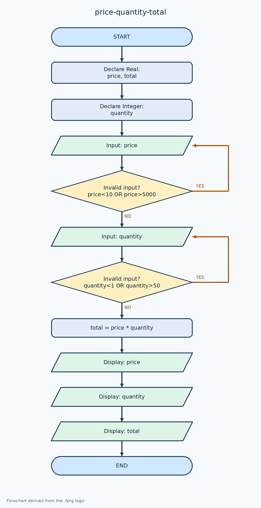

# คำนวณราคารวมจากราคาและจำนวนสินค้า

[← กลับหน้าหลัก](../README.md) · [ดาวน์โหลดไฟล์ Flowgorithm](./price-quantity-total.fprg)

## โจทย์

ตรวจราคาและจำนวนสินค้าแยกกัน แล้วคำนวณราคารวม

**แนวคิดที่ฝึก:** การตรวจข้อมูลหลายค่าและเงื่อนไขที่สัมพันธ์กัน

## Flowchart



> ภาพนี้ถอดจากตรรกะในไฟล์ `.fprg` เพื่อให้ดูบน GitHub ได้ทันที ส่วนผังงานต้นฉบับให้ดาวน์โหลดไฟล์แล้วเปิดด้วย Flowgorithm

## Pseudocode

```text
เริ่มต้น
    ประกาศ Real price, total
    ประกาศ Integer quantity
    ทำซ้ำ
        แสดงผล "กรอกราคาสินค้า (10-5000 บาท)"
        รับค่า price
    ขณะที่ price < 10 หรือ price > 5000
    ทำซ้ำ
        แสดงผล "กรอกจำนวนสินค้า (1-50 ชิ้น)"
        รับค่า quantity
    ขณะที่ quantity < 1 หรือ quantity > 50
    total ← price * quantity
    แสดงผล "ราคาสินค้า = " & price & " บาท"
    แสดงผล "จำนวนสินค้า = " & quantity & " ชิ้น"
    แสดงผล "ราคารวม = " & total & " บาท"
จบการทำงาน
```

## ทดลองให้ครบ

- ทดสอบค่าปกติที่ควรผ่าน
- หากมีการตรวจช่วง ให้ทดสอบค่าต่ำกว่าขอบเขตและสูงกว่าขอบเขต
- เปรียบเทียบผลลัพธ์กับการคำนวณด้วยตนเอง
