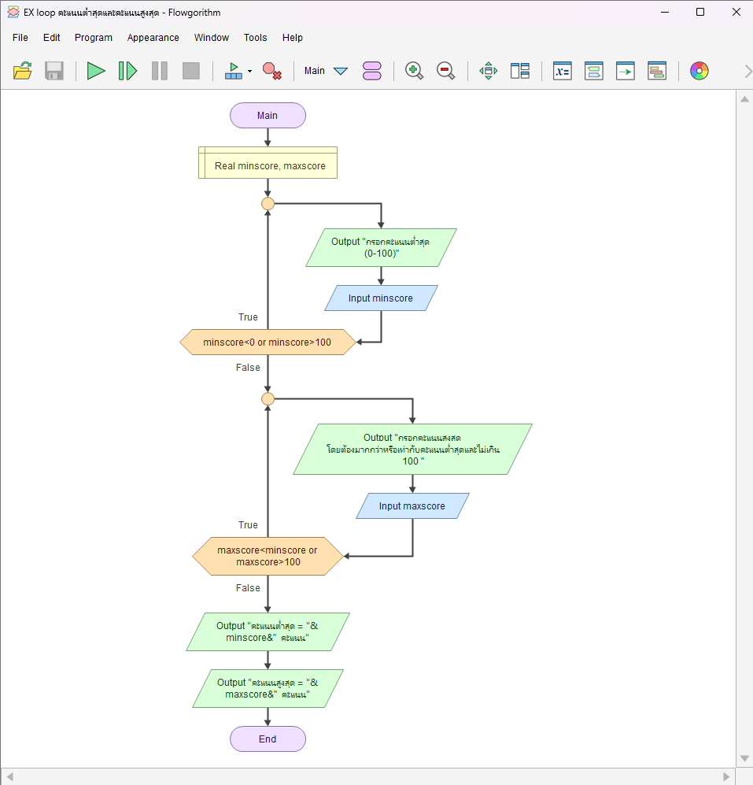

# ตรวจคะแนนต่ำสุดและสูงสุดที่สัมพันธ์กัน

[← กลับหน้าหลัก](../README.md) · [ดาวน์โหลดไฟล์ Flowgorithm](./score-range-validation.fprg)

## โจทย์

ตรวจคะแนนต่ำสุดให้อยู่ในช่วง 0–100 และบังคับให้คะแนนสูงสุดไม่น้อยกว่าคะแนนต่ำสุด

**แนวคิดที่ฝึก:** การตรวจข้อมูลหลายค่าและเงื่อนไขที่สัมพันธ์กัน

## Flowchart



> ภาพนี้ถอดจากตรรกะในไฟล์ `.fprg` เพื่อให้ดูบน GitHub ได้ทันที ส่วนผังงานต้นฉบับให้ดาวน์โหลดไฟล์แล้วเปิดด้วย Flowgorithm

## Pseudocode

```text
เริ่มต้น
    ประกาศ Real minscore, maxscore
    ทำซ้ำ
        แสดงผล "กรอกคะแนนต่ำสุด (0-100)"
        รับค่า minscore
    ขณะที่ minscore < 0 หรือ minscore > 100
    ทำซ้ำ
        แสดงผล "กรอกคะแนนสูงสุด (ไม่น้อยกว่าคะแนนต่ำสุดและไม่เกิน 100)"
        รับค่า maxscore
    ขณะที่ maxscore < minscore หรือ maxscore > 100
    แสดงผล "คะแนนต่ำสุด = " & minscore & " คะแนน"
    แสดงผล "คะแนนสูงสุด = " & maxscore & " คะแนน"
จบการทำงาน
```

## ทดลองให้ครบ

- ทดสอบค่าปกติที่ควรผ่าน
- หากมีการตรวจช่วง ให้ทดสอบค่าต่ำกว่าขอบเขตและสูงกว่าขอบเขต
- เปรียบเทียบผลลัพธ์กับการคำนวณด้วยตนเอง
