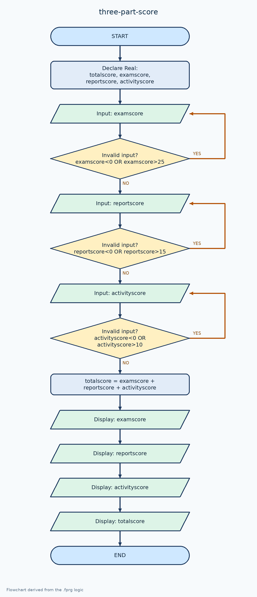

# ตรวจและรวมคะแนน 3 ส่วน

[← กลับหน้าหลัก](../README.md) · [ดาวน์โหลดไฟล์ Flowgorithm](./three-part-score.fprg)

## โจทย์

ตรวจคะแนนสอบ รายงาน และกิจกรรมตามช่วงของแต่ละส่วน แล้วคำนวณคะแนนรวม

**แนวคิดที่ฝึก:** การตรวจข้อมูลหลายค่าและเงื่อนไขที่สัมพันธ์กัน

## Flowchart



> ภาพนี้ถอดจากตรรกะในไฟล์ `.fprg` เพื่อให้ดูบน GitHub ได้ทันที ส่วนผังงานต้นฉบับให้ดาวน์โหลดไฟล์แล้วเปิดด้วย Flowgorithm

## Pseudocode

```text
เริ่มต้น
    ประกาศ Real totalscore, examscore, reportscore, activityscore
    ทำซ้ำ
        แสดงผล "กรุณากรอกคะแนนสอบ (0-25)"
        รับค่า examscore
    ขณะที่ examscore < 0 หรือ examscore > 25
    ทำซ้ำ
        แสดงผล "กรุณากรอกคะแนนรายงาน (0-15)"
        รับค่า reportscore
    ขณะที่ reportscore < 0 หรือ reportscore > 15
    ทำซ้ำ
        แสดงผล "กรุณากรอกคะแนนการบ้านและการเข้าเรียน (0-10)"
        รับค่า activityscore
    ขณะที่ activityscore < 0 หรือ activityscore > 10
    totalscore ← examscore + reportscore + activityscore
    แสดงผล "คะแนนสอบ = " & examscore & " คะแนน"
    แสดงผล "คะแนนรายงาน = " & reportscore & " คะแนน"
    แสดงผล "คะแนนการบ้านและการเข้าเรียน = " & activityscore & " คะแนน"
    แสดงผล "คะแนนรวม = " & totalscore & " คะแนน"
จบการทำงาน
```

## ทดลองให้ครบ

- ทดสอบค่าปกติที่ควรผ่าน
- หากมีการตรวจช่วง ให้ทดสอบค่าต่ำกว่าขอบเขตและสูงกว่าขอบเขต
- เปรียบเทียบผลลัพธ์กับการคำนวณด้วยตนเอง
