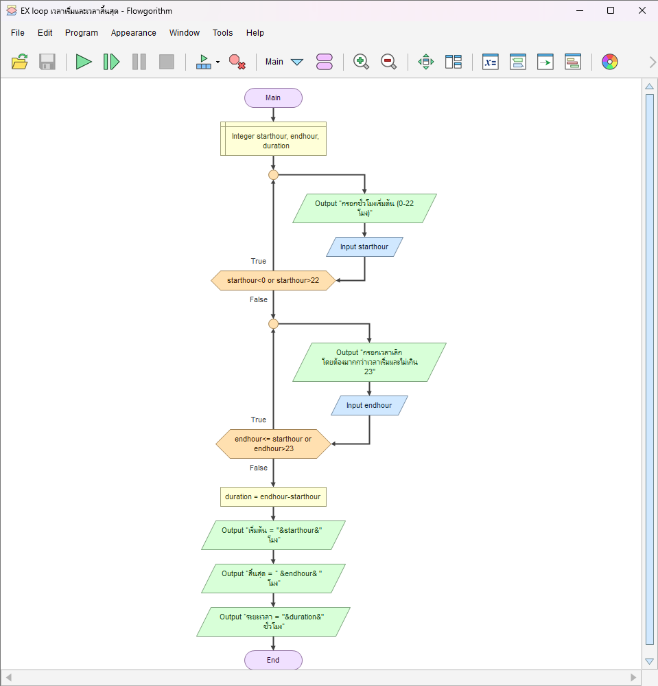

# ตรวจเวลาเริ่ม–สิ้นสุดและคำนวณระยะเวลา

[← กลับหน้าหลัก](../README.md) · [ดาวน์โหลดไฟล์ Flowgorithm](./time-duration.fprg)

## โจทย์

ตรวจเวลาเริ่มก่อน แล้วบังคับให้เวลาสิ้นสุดมากกว่าเวลาเริ่มเพื่อคำนวณระยะเวลา

**แนวคิดที่ฝึก:** การตรวจข้อมูลหลายค่าและเงื่อนไขที่สัมพันธ์กัน

## ผังงานจาก Flowgorithm



> ภาพหน้าจอนี้มาจากโปรแกรม Flowgorithm และจับคู่กับไฟล์ต้นฉบับของโจทย์นี้โดยตรง

## Pseudocode

```text
เริ่มต้น
    ประกาศ Integer starthour, endhour, duration
    ทำซ้ำ
        แสดงผล "กรอกชั่วโมงเริ่มต้น (0-22 โมง)"
        รับค่า starthour
    ขณะที่ starthour < 0 หรือ starthour > 22
    ทำซ้ำ
        แสดงผล "กรอกเวลาเลิก โดยต้องมากกว่าเวลาเริ่มและไม่เกิน 23"
        รับค่า endhour
    ขณะที่ endhour <= starthour หรือ endhour > 23
    duration ← endhour - starthour
    แสดงผล "เริ่มต้น = " & starthour & " โมง"
    แสดงผล "สิ้นสุด = " & endhour & " โมง"
    แสดงผล "ระยะเวลา = " & duration & " ชั่วโมง"
จบการทำงาน
```

## ทดลองให้ครบ

- ทดสอบค่าปกติที่ควรผ่าน
- หากมีการตรวจช่วง ให้ทดสอบค่าต่ำกว่าขอบเขตและสูงกว่าขอบเขต
- เปรียบเทียบผลลัพธ์กับการคำนวณด้วยตนเอง
