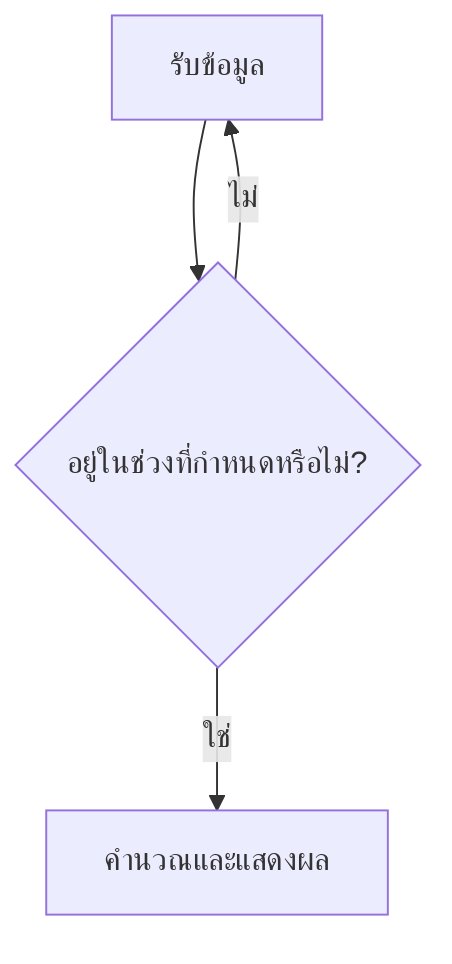

# COS1103 Flowgorithm Practice

แบบฝึกหัดส่วนตัวสำหรับฝึกออกแบบอัลกอริทึมด้วย Flowgorithm ตั้งแต่การทำงานตามลำดับ การตรวจสอบข้อมูลด้วย `Do...While` ไปจนถึงโจทย์ที่มีข้อมูลหลายค่าซึ่งสัมพันธ์กัน

> A first-year computer science practice repository containing 20 Flowgorithm programs. The exercises demonstrate sequence, input validation, calculations, and validation between related inputs.

## จุดประสงค์

- ฝึกแยกปัญหาเป็น Input–Process–Output
- ฝึกตั้งชื่อตัวแปรและเลือกชนิดข้อมูล
- ป้องกันข้อมูลนอกช่วงด้วย `Do...While`
- ฝึกคำนวณจากข้อมูลหลายค่า
- เก็บหลักฐานพัฒนาการด้านการเขียนโปรแกรมตั้งแต่ปี 1

## ลำดับการเรียนรู้

| หมวด | จำนวน | เนื้อหา | ตัวอย่าง |
|---|---:|---|---|
| `01-basic-sequence` | 4 | รับข้อมูล คำนวณ และแสดงผล | พื้นที่สี่เหลี่ยม, VAT 7% |
| `02-input-validation` | 9 | ตรวจช่วงข้อมูลก่อนนำไปใช้ | อายุ, คะแนน, ราคา, ส่วนลด |
| `03-multiple-inputs` | 7 | ตรวจข้อมูลหลายค่าที่สัมพันธ์กัน | BMI, ยอดถอน, ช่วงเวลา, คะแนนรวม |

## แบบฝึกหัดทั้งหมด

### 1. Basic sequence

- [`rectangle-area.fprg`](01-basic-sequence/rectangle-area.fprg) — คำนวณพื้นที่สี่เหลี่ยมผืนผ้า
- [`midterm-final-total.fprg`](01-basic-sequence/midterm-final-total.fprg) — รวมคะแนนกลางภาคและปลายภาค
- [`three-subject-average.fprg`](01-basic-sequence/three-subject-average.fprg) — หาคะแนนเฉลี่ย 3 วิชา
- [`vat-calculator.fprg`](01-basic-sequence/vat-calculator.fprg) — คำนวณ VAT 7% และยอดสุทธิ

### 2. Input validation

- [`age-validation.fprg`](02-input-validation/age-validation.fprg) — อายุ 1–120 ปี
- [`price-validation.fprg`](02-input-validation/price-validation.fprg) — ราคา 1–5,000 บาท
- [`quantity-validation.fprg`](02-input-validation/quantity-validation.fprg) — จำนวนสินค้า 1–100 ชิ้น
- [`score-validation.fprg`](02-input-validation/score-validation.fprg) — คะแนน 0–100
- [`midterm-score-validation.fprg`](02-input-validation/midterm-score-validation.fprg) — คะแนนกลางภาค 0–40
- [`temperature-validation.fprg`](02-input-validation/temperature-validation.fprg) — อุณหภูมิ -40 ถึง 60 องศาเซลเซียส
- [`battery-validation.fprg`](02-input-validation/battery-validation.fprg) — แบตเตอรี่ 0–100%
- [`work-hours-validation.fprg`](02-input-validation/work-hours-validation.fprg) — ชั่วโมงทำงาน 1–12 ชั่วโมง
- [`discount-calculator.fprg`](02-input-validation/discount-calculator.fprg) — ตรวจราคาและคำนวณส่วนลด 10%

### 3. Multiple and related inputs

- [`price-quantity-total.fprg`](03-multiple-inputs/price-quantity-total.fprg) — ราคารวมจากราคาและจำนวนสินค้า
- [`deposit-withdrawal-balance.fprg`](03-multiple-inputs/deposit-withdrawal-balance.fprg) — ตรวจยอดถอนและหายอดคงเหลือ
- [`bmi-calculator.fprg`](03-multiple-inputs/bmi-calculator.fprg) — ตรวจน้ำหนักและส่วนสูงก่อนคำนวณ BMI
- [`score-range-validation.fprg`](03-multiple-inputs/score-range-validation.fprg) — ตรวจคะแนนต่ำสุดและสูงสุดที่สัมพันธ์กัน
- [`time-duration.fprg`](03-multiple-inputs/time-duration.fprg) — ตรวจเวลาเริ่ม–สิ้นสุดและหาระยะเวลา
- [`three-part-score.fprg`](03-multiple-inputs/three-part-score.fprg) — รวมคะแนน 3 ส่วน
- [`four-part-score.fprg`](03-multiple-inputs/four-part-score.fprg) — รวมคะแนน 4 ส่วน

## แนวคิดการตรวจสอบข้อมูล



ตัวอย่างเงื่อนไขตรวจคะแนน:

```text
Do
    Output "กรอกคะแนน (0-100)"
    Input score
While score < 0 or score > 100
```

## วิธีเปิดไฟล์

1. ติดตั้ง [Flowgorithm](http://www.flowgorithm.org/)
2. ดาวน์โหลดหรือ Clone repository นี้
3. เปิดไฟล์นามสกุล `.fprg` ด้วย Flowgorithm
4. กด Run แล้วทดลองทั้งค่าที่ถูกต้อง ค่าต่ำกว่าช่วง และค่าสูงกว่าช่วง

## หมายเหตุ

Repository นี้เป็นแบบฝึกหัดส่วนตัวเพื่อแสดงพัฒนาการ ไม่ใช่เอกสารหรือเฉลยอย่างเป็นทางการของรายวิชา COS1103

Created by [Koko777-Python](https://github.com/Koko777-Python)
